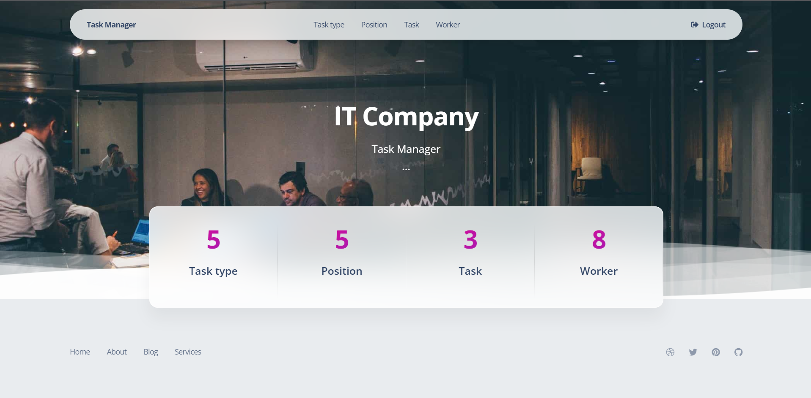

# it-company
## Model

## Prepare the project
1. Fork the repo (GitHub repository)
2. Clone the forked repo
    ```
    git clone the-link-from-your-forked-repo
    ```
    - You can get the link by clicking the `Clone or download` button in your repo
3. Open the project folder in your IDE
4. Open a terminal in the project folder
5. If you are using PyCharm - it may propose you to automatically create venv for your project 
    and install requirements in it, but if not:
    ```
    python -m venv venv
    venv\Scripts\activate (on Windows)
    source venv/bin/activate (on macOS)
    pip install -r requirements.txt
    ```
6. Use the following command to load prepared data from fixture to test and debug your code:
   ```
   python manage.py loaddata it_company_task_manager_db_data.json
   ```
7. After loading data from fixture you can use following superuser (or create another one by yourself):
   ```
   Login: admin.user
   Password: 1qazcde3
   ```
   - Feel free to add more data using admin panel, if needed.
#
   - 
